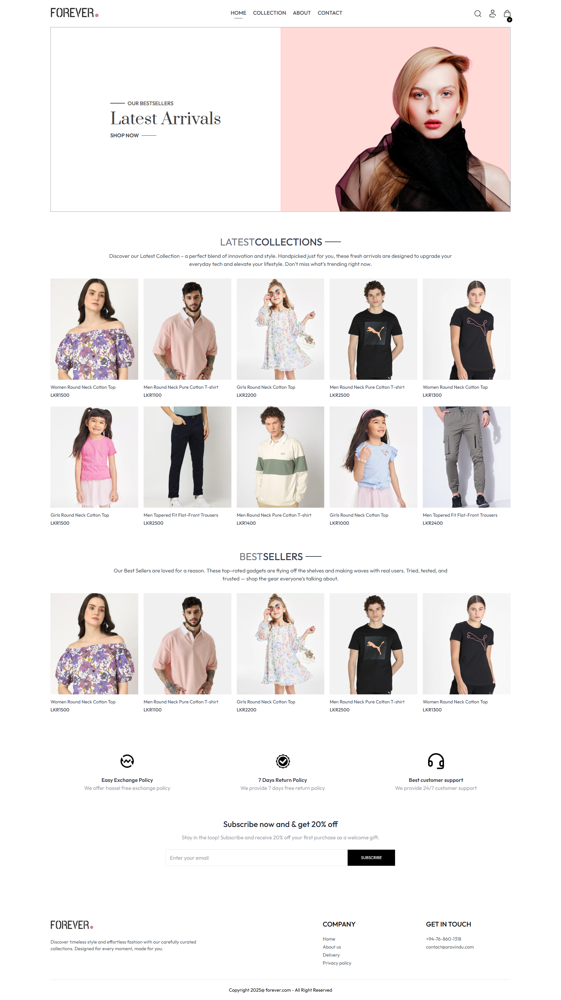
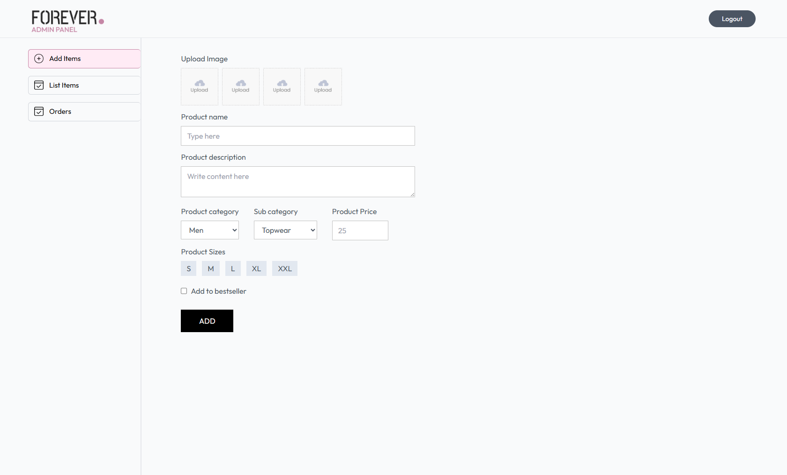
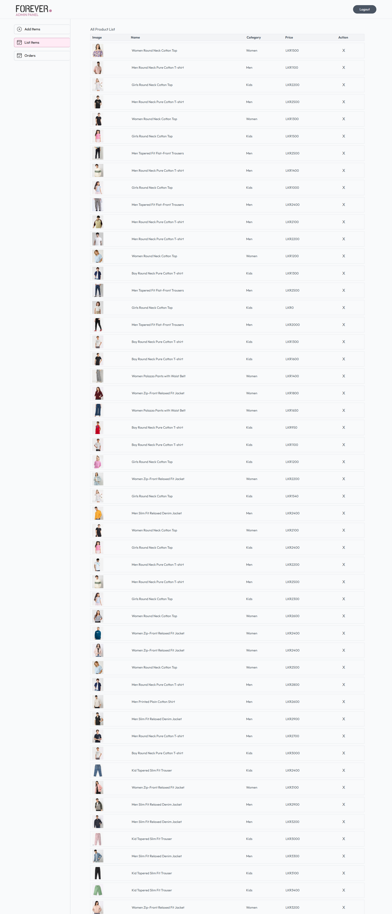

# 👗 Forever — Modern Clothing E-Commerce Platform

Welcome to **Forever**, a full-featured e-commerce website for a stylish clothing store.  
Built with modern technologies to deliver fast performance, a beautiful UI, and seamless shopping & admin experience.

---

## 🌐 Live Demo

- 🛍️ **Frontend (Customer Store):** [forever store](https://ecommerce-website-frontend-azure.vercel.app/)
- 🧑‍💼 **Admin Panel:** [admin dashboard](https://ecommerce-website-admin-virid.vercel.app/)
- ⚙️ **Backend API:** [backend service](https://ecommerce-website-backend-red.vercel.app/)

---

## 🛠️ Tech Stack

### Frontend & Admin Panel
- ⚛️ React + Vite
- 🛒 Fully responsive UI
- 📦 Tailwind CSS

### Backend
- 🌐 Node.js + Express
- 🍃 MongoDB (Mongoose)
- ☁️ Cloudinary (for image upload)
- 💳 Stripe + Manual Payment Options
- 🔐 JWT Authentication & Role-based Access

---

## 🚀 Features

### 🛍️ Customer Frontend
- Browse categories & products
- Add to cart & wishlist
- Product filtering by size, price, category
- Checkout with Stripe or Manual payment
- Order history & order tracking
- Mobile-friendly & fast loading

### 🧑‍💼 Admin Dashboard
- Manage products, categories & orders
- Upload product images to Cloudinary
- Dashboard analytics
- Secure admin login

---

## 📸 Screenshots

> You can add screenshots by placing them in a `/screenshots` folder and linking them here:

```markdown
### 🛍️ Storefront




### 🧑‍💼 Admin Panel




## 💻 Getting Started

Follow these steps to set up and run the project locally:

### 1️⃣ Clone the Repository

```bash
git clone https://github.com/your-username/forever-ecommerce.git
cd forever-ecommerce
```
### 2️⃣ Install Dependencies

#### 🛍️ Frontend & Admin Panel (React + Vite)

```bash
cd client
npm install
npm run dev
```
#### ⚙️ Backend (Express + MongoDB)

```bash
cd backend
npm install
npm run dev
```
## 3️⃣ 🔐 Configure Environment Variables
Create .env files inside both the client and backend folders with your own API keys and service credentials.

## 4️⃣ ✅ Run the App
- 🛒 Frontend: http://localhost:5173

- 🧑‍💼 Admin: http://localhost:5173/admin

- ⚙️ Backend API: http://localhost:5000
